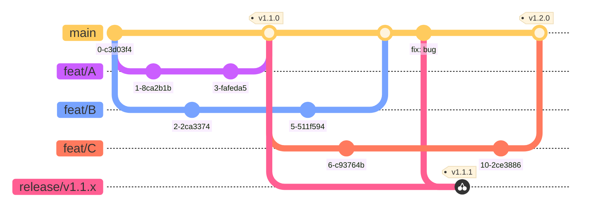
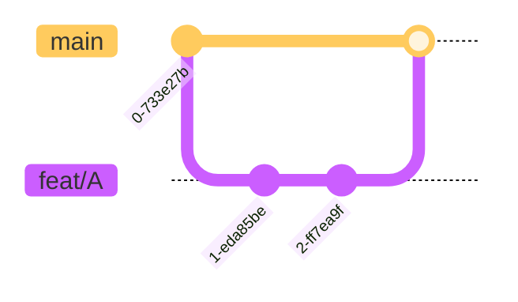
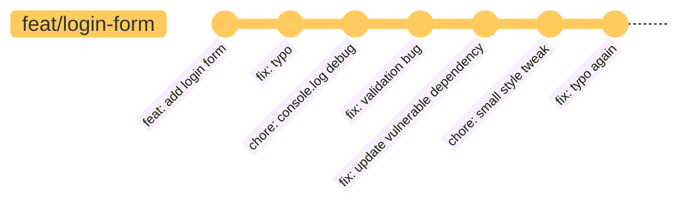
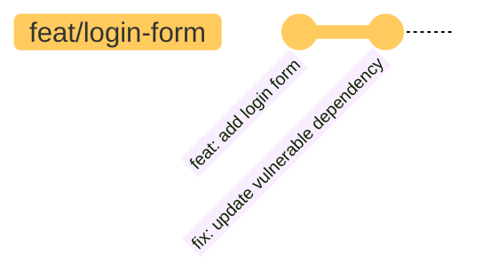
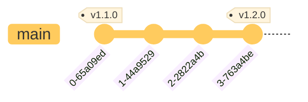
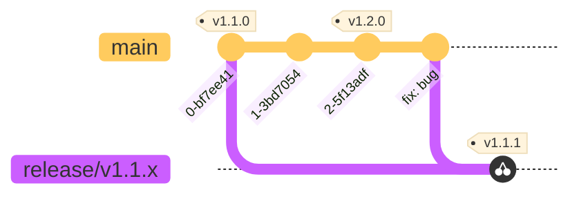

# Git Branching and Release Strategy

## Introduction

For this repository we employ something called _Trunk Based Development_.

> As described on [trunkbaseddevelopment.com][trunk]: _"A source-control branching model that focuses on collaborating through a single branch, the 'trunk'."_

There is a lot of information to be found on _Trunk Based Development_, but we will try to summarise the most important parts for this project here.

In essence:

- Collaboration between developers happens through _regular_ commits to a single branch, the "trunk".
- Developers strive to keep the code in the trunk working at all times (builds, passes tests, etc.). _Every commit on the trunk should be releasable_.
- Developers commit to short-lived feature branches that are merged into the trunk after successful review.
- Feature branches don't last more than a few days max and only a single developer (or pair of developers) commits to a single feature branch.
- Releasing happens either directly from the trunk (tagging a commit) or from release branches branched off of the trunk.
- Commit messages follow the [Conventional Commits][cc] specification (e.g. `feat:`, `fix:`, `chore:`).

## Quick overview

In the diagram below you can see a brief overview of what this looks like. Feature branches are always merged back into the `main` branch. Releases are tagged from the `main` branch. Release branches are optional, and only become necessary when a bug needs to be fixed on a specific (minor) version. Bug fixes _always_ take place on the `main` branch and are _cherry-picked_ into a release branch.

> _Release branches are never merged back into the `main` branch._



## New features

New features are developed on a dedicated feature branch (`feat/`) by one or a pair of developers. The aim is to deliver a new feature that can be merged back into the `main` branch within a few days.

> Avoiding long-lived branches helps to keep developers more aligned and greatly reduces issues due to large and complex merge conflicts.



Once a feature is ready to be merged back to the `main` branch, a pull request is created to be reviewed.

When the pull request passes all the automated tests and checks it is reviewed.
Only after all checks pass and a code owner\* approves the pull request can it be merged into `main`.

> \*A code owner is a developer responsible for this repository. They are listed in the root `.github/CODEOWNERS` file.

### Feature flags

If a new feature is not ready for production it should be placed behind a feature flag. By making use of a feature flag the new code can already be merged back into the `main` branch much sooner. This avoids what would otherwise become a potentially _long-lived branch_.

### Before opening a pull request

Before a feature branch is merged back into `main` (and during development) the developer should update their feature branch with the `main` branch.
The developer should also ensure the commits are cleaned up before submitting the PR for review.

<details>

<summary><strong>Commit guidelines</strong> <i>(click for details)</i></summary>

#### Clean commit history

Commit messages should follow the [Conventional Commits specification][cc]. This is what powers our generated changelogs — `feat: new feature added`, `fix: patched a bug`, and so on.

When updating a branch with `main` you would ideally do this by rebasing, as this helps to keep the git history cleaner.

```
$ git checkout feat/login-form
$ git rebase main
```

Once the branch is up to date with `main`, the developer is also recommended to perform an interactive rebase on their branch before opening a pull request. This further helps to keep the git history cleaner by combining or squashing related commits and avoiding unnecessary commits and commit messages.

```
git fetch origin
git rebase -i origin/main
```

> This can be done via the CLI but a GUI can also be very helpful. We recommend [Fork][git-fork]. The free evaluation is unlimited, so it is up to you to support the creators if you find the tool helpful.

Before interactive rebase:



After interactive rebase:



<hr>
</details>

### Pull Request merge strategy

We currently only allow pull requests to be merged using a _merge commit_.

- _squash merge_ can accidentally remove important commit messages that we might need for generated changelogs.
- _rebase merge_ can be problematic as all commits are required to be signed by the developer.

## Releases

Since the goal is to have the trunk (`main` branch) always in a working state, a new release can therefore be created at any time from the `main` branch by creating a new version tag on the latest commit. We follow [semantic versioning](https://semver.org/) (major.minor.patch).
This version tag can then be used to deploy this version to any environment.



<br/>

> Tags and (release) branches do not contain any information about whether a version is stable, which environment it is deployed to, or whether it has passed QA.
> Every commit to the `main` branch should be in a releasable state — deployment environment and QA status should be tracked elsewhere.
> For example, a `version.json` file included in the build artifact can record which version is deployed on a given environment, or this information can be tracked on the GitHub project board.

### Release branches

Release branches are optional. If releases are done frequently there might not be a need for a release branch. _A release branch is only needed to fix bugs on a specific release (minor) version._
A release branch can therefore also be created only when the need arises. For example: `v1.1.0` is in production and `v1.2.0` has already been created.

> It is important to note that _release branches are never merged back_ to the `main` branch, as no work should be done directly on a release branch.

Alternatively, instead of creating a release branch in order to fix a bug on a specific version, a new release could also be considered. A new release would, however, include any features merged since the last release, which may require an additional QA cycle.

## Bug fixes

When a bug is found it will be fixed on the `main` branch. This ensures the `main` branch remains in a working state and also ensures other feature branches can quickly update with the new fix. The bugfix can then be _cherry-picked_ into a release branch.



Since our `main` branch is protected, bug fixes will also have to be submitted via a pull request using a `fix/` branch.

## Branch naming conventions

When a branch is created due to a GitHub issue, this GitHub issue number is prefixed in the branch name (e.g. `feat/123-my-issue`).

We use the following branch naming conventions:

| Prefix     | Purpose                                         | Example                     |
| ---------- | ----------------------------------------------- | --------------------------- |
| `feat/`    | A new feature                                   | `feat/123-login-form`       |
| `fix/`     | A bug fix on main                               | `fix/46-validation-error`   |
| `chore/`   | Non-functional changes (deps, config, tooling)  | `chore/update-dependencies` |
| `release/` | A release branch for a specific (minor) version | `release/v1.1.x`            |

[trunk]: https://trunkbaseddevelopment.com
[git-fork]: https://git-fork.com/
[cc]: https://www.conventionalcommits.org/
